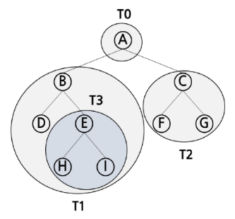

# Tree
## 개념
- 비선형 자료구조
- 원소들 간에 1:N 관계를 가지는 계층적 구조
- 원소들 간에 계층관계를 가지는 자료구조
- 상위 원소에서 하위 원소로 내려가며 확장되는 모양의 구조

## Tree 간의 관계
- 트리는 노드와 간선으로 구성됩니다.
- 트리에서 노드 간의 관계는 부모-자식 관계로 표현됩니다.
- 트리에서 루트 노드는 최상위 노드로, 부모가 없는 노드입니다.
- 트리에서 리프 노드는 자식이 없는 노드입니다.
- 트리에서 형제 노드는 같은 부모를 가진 노드들입니다.

### LIST로 TREE를 표현했을 때 INDEX 관계.
- 해당 방식으로 트리를 표현할 때는, 이진트리만 표현할 수 있습니다.
- 트리에서 노드의 인덱스 관계는 다음과 같습니다:
  - 현재 노드의 인덱스: i
  - 왼쪽 자식 노드의 인덱스: 2i
  - 오른쪽 자식 노드의 인덱스: 2i + 1
  - 부모 노드의 인덱스: i // 2
- 이 방식은 완전 이진 트리를 표현하는 데 적합하며, 트리의 노드가 배열 형태로 저장될 때 사용됩니다.


## Tree의 순회
### 순회
- 트리의 모든 노드를 방문하는 과정
- 트리의 순회 방법에는 크게 세 가지가 있습니다

1. 전위 순회 ( Preorder Traversal \<VLR> )
2. 중위 순회 ( Inorder Traversal \<LVR> )
3. 후위 순회 ( Postorder Traversal \<LRV> )
- 각 순회 방법은 노드를 방문하는 순서에 따라 다릅니다.
- 부모 노드를 언제 방문하는지에 따라서 순회 방법이 구분됩니다.
- <span style="color:red">**주의**</span> 서브트리 루트에서 순회를 시작하면, 서브트리 안에서만 순회해야합니다.



### 전위 순회 ( Preorder Traversal \<VLR> )
현재 노드 T를 방문한 후, 왼쪽 서브트리를 순회하고, 마지막으로 오른쪽 서브트리를 순회하는 방법입니다.

상단의 그림 기준으로 전위 순회는 다음과 같은 순서로 노드를 방문합니다: A → B → D → E → H → I → C → F → G
```python
def preorder_traversal(node):
    if node is not None:
        print(node.value)  # 현재 노드 방문
        preorder_traversal(node.left)  # 왼쪽 서브트리 순회
        preorder_traversal(node.right)  # 오른쪽 서브트리 순회
```

### 중위 순회 ( Inorder Traversal \<LVR> )
현재 노드 T의 왼쪽 서브트리를 순회한 후, 현재 노드를 방문하고, 마지막으로 오른쪽 서브트리를 순회하는 방법입니다.

상단의 그림 기준으로 중위 순회는 다음과 같은 순서로 노드를 방문합니다: D → B → H → E → I → A → F → C → G
```python
def inorder_traversal(node):
    if node is not None:
        inorder_traversal(node.left)  # 왼쪽 서브트리 순회
        print(node.value)  # 현재 노드 방문
        inorder_traversal(node.right)  # 오른쪽 서브트리 순회
```

### 후위 순회 ( Postorder Traversal \<LRV> )
현재 노드 T의 왼쪽 서브트리를 순회한 후, 오른쪽 서브트리를 순회하고, 마지막으로 현재 노드를 방문하는 방법입니다.

상단의 그림 기준으로 후위 순회는 다음과 같은 순서로 노드를 방문합니다: D → H → I → E → B → F → G → C → A
```python
def postorder_traversal(node):
    if node is not None:
        postorder_traversal(node.left)  # 왼쪽 서브트리 순회
        postorder_traversal(node.right)  # 오른쪽 서브트리 순회
        print(node.value)  # 현재 노드 방문
```
