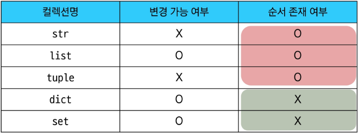

# DataTypes
## Sequence type & Editable && NonSequence type & UnEditable
파이썬에서 자주 사용되는 컬렉션 데이터형들은 크게

### 1. list
Sequence 임으로 내부 요소들에 대한 **인덱싱** 및 슬라이싱이 가능하고, 요소 추가, 수정 등의 **편집이 가능한** 연속된 메모리 주소를 가지는 데이터형이다.
list 를 만드는 방법은 다양하다.
```
# 1. 기본적인 생성법
my_list = [] # 빈 리스트 생성
my_list = [1, 2, 3, 4, 5]
my_list = ['apple', 2, 'cherry'] # 다양한 타입 혼합 가능

# 2. list() 생성자 사용
my_list = list() # 빈 리스트 생성

# 3. 다른 UnEditable 객체를 리스트로 변환
my_list = list((1, 2, 3)) # 튜플을 리스트로 변환, 외에도 문자열, 집합 등을 리스트로 변환 가능
```
### 2. tuple
Sequence 임으로 내부 요소들에 대한 **인덱싱** 및 슬라이싱이 가능하고, 요소 추가, 수정 등의 **편집이 불가능한** 연속된 메모리 주소를 가지는 데이터형이다.
tuple 을 만드는 방법 또한 다양하다.
```
# 1. 기본적인 생성법
my_tuple = () # 빈 튜플 생성
my_tuple = tuple() # 빈 튜플 생성
my_tuple = (1, 2, 3, 4, 5)
my_tuple = ('apple', 2, 'cherry') # 다양한 타입 혼합 가능

# 2. 단일 요소 튜플 생성 시 콤마 주의
single_element_tuple = (5,) # 콤마 필수
single_element_not_tuple = (5) # 튜플 아님, 정수형이다.

# 3. 다른 Editable 객체를 튜플로 변환
my_tuple = tuple([1, 2, 3]) # 리스트를 튜플로 변환, 외에도 문자열, 집합 등을 튜플로 변환 가능
```
### 3. range
연속된 정수 시퀀스를 생성하는 데이터형이다. 주로 반복문에서 특정 횟수만큼 반복할 때 사용된다. range 객체는 **인덱싱** 및 슬라이싱이 가능하지만, 요소 추가, 수정 등의 **편집이 불가능하다.**
```
my_range = range(10) # 0부터 9까지의 정수 시퀀스 생성
my_range = range(5, 10) # 5부터 9까지의 정수 시퀀스 생성
my_range = range(0, 10, 2) # 0부터 8까지의 짝수 시퀀스 생성
print(my_range) # range(0, 10, 2) // list로 변환하지 않았기 때문에 range 객체로 출력
print(list(my_range)) # [0, 2, 4, 6, 8] // list로 변환하여 출력

```
나중에 반복문을 배울 때 더 자세히 다룰 예정이다.
### 4. dict
Key-Value 쌍으로 이루어진 데이터형으로, 각 Key는 고유해야 하며 변경 불가능한 자료형만 사용 가능하다.그러나 Value는 중복될 수 있고, 어떠한 자료형이든 자유롭게 사용 가능하다. dict 는 **인덱싱**이 불가능하지만, Key를 통해 Value에 접근할 수 있다. 또한 요소 추가, 수정 등이 **편집이 가능한** 데이터형이다.
**순서가 없다는 것에 유의해야함**
```
# 1. 기본적인 생성법
my_dict = {} # 빈 딕셔너리 생성
my_dict = dict() # 빈 딕셔너리 생성
my_dict = {'name': 'Alice', 'age': 25, 'city': 'New York'}

# 2. dict() 생성자 사용
my_dict = dict(name='Bob', age=30, city='Los Angeles')

# 3. 객체 추가 가능
my_dict['job'] = 'Engineer' # 새로운 Key-Value 쌍 추가
my_dict['age'] = 26 # 기존 Key의 Value 수정

```
### 5. set
순서가 없고, 중복을 허용하지 않는 데이터형이다. set 은 **인덱싱**이 불가능하며, 요소 추가, 삭제 등이 **편집이 가능한** 데이터형이다.
```
# 1. 기본적인 생성법
my_set = set() # 빈 집합 생성
# 비어있는 딕셔너리와의 혼동을 피하기 위해 빈 집합은 반드시 set() 생성자를 사용해야 한다.

my_set = {1, 2, 3, 4, 5}
my_set = {'apple', 2, 'cherry'} # 다양한 타입 혼합 가능

```
Set는 집합연산에 주로 사용되는데(= 평상시에는 잘 사용되지 않는데), 아주 강력한 도구이다.
```
A = {1, 2, 3, 4}
B = {3, 4, 5, 6}
# 교집합
print(A & B) # {3, 4}
# 합집합
print(A | B) # {1, 2, 3, 4, 5, 6}
# 차집합
print(A - B) # {1, 2}
```

## 