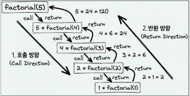
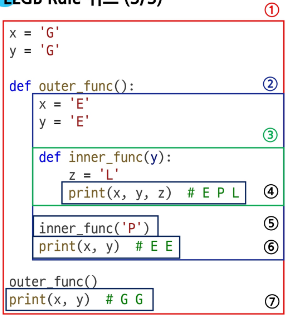

# Functions
오늘은 함수에 대해 수업을 진행했다. 이에 따라 함수에 대해 정리해본다.
## 함수
특정 작업을 수행하기 위한 재사용 가능한 코드 묶음이다.
### 함수 구조
```python
def 함수이름(매개변수1, 매개변수2, ...):
    """함수 설명 (Docstring)"""
    # 함수 본문
    return 반환값

# 함수 호출
result = 함수이름(인자1, 인자2, ...)
``` 
#### 함수 정의
- `def` 키워드를 사용하여 함수를 정의한다.
- 함수 이름은 소문자와 밑줄(_)을 사용하여 작성하는 것이 일반적이다.
#### INPUT & OUTPUT
- 입력 (Input): 함수에 전달되는 값들로, **매개변수**를 통해 함수 내부로 전달된다.
- 출력 (Output): 함수가 작업을 완료한 후 반환하는 값으로, **`return` 문**을 통해 반환된다.
#### Docstring
- 함수의 목적과 사용법을 설명하는 문자열로, 함수 정의 바로 아래에 위치한다.
- 개발자의 문서화 능력에 도움이 되는 부분으로, 귀찮더라도 작성해야 다음에 내가 무슨 함수를 만든 것인지를 알 수 있다.
#### Body
- 함수가 수행하는 작업을 포함하는 코드 묶음이다.
## 매개변수와 인자
### 매개변수 (Parameters)
함수 정의 시 함수에 전달되는 값을 받는 변수들이다.

### 인자 (Arguments)
함수 호출 시 실제로 전달되는 값들이다.
#### 인자 종류
- 위치 인자 (Positional Arguments): 인자의 순서에 따라 매개변수에 전달된다.
```python
    def greet(name, age):
        return f"Hello, my name is {name} and I'm {age} years old."
    message = greet("Alice", 30)  # 위치 인자
    print(message)  # Hello, my name is Alice and I'm 30 years old.

    message = greet(30, "Alice")  # 순서 바뀜
    print(message)  # Hello, my name is 30 and I'm Alice years old.
```
인자의 순서가 중요하다.

- 기본 인자 (Default Arguments): 매개변수에 기본값을 지정할 수 있다.
```python
    def greet(name, age=25):
        return f"Hello, my name is {name} and I'm {age} years old."
    message = greet("Bob")  # age는 기본값 25 사용
    print(message)  # Hello, my name is Bob and I'm 25 years old.

    message = greet("Bob", 30)  # age에 30 전달
    print(message)  # Hello, my name is Bob and I'm 30 years old.
```
매개변수에 기본값을 지정하면, 인자를 전달하지 않아도 기본값이 사용된다.

- 키워드 인자 (Keyword Arguments): 매개변수 이름을 명시하여 전달된다.
```python
    def greet(name, age):
        return f"Hello, my name is {name} and I'm {age} years old."
    message = greet(age=28, name="Charlie")  # 키워드 인자
    print(message)  # Hello, my name is Charlie and I'm 28 years old.
    
    greet(name="Charlie", age=28)  # 순서 바뀜
    print(message)  # Hello, my name is Charlie and I'm 28 years old.

    greet("Charlie", age=28)  # 위치 인자와 키워드 인자 혼합
    print(message)  # Hello, my name is Charlie and I'm 28 years old.
    
    greet(age=28, "Charlie")  # 오류 발생
    print(message)  # SyntaxError: positional argument follows keyword argument
```
키워드 인자를 사용하면 인자의 순서에 상관없이 값을 전달할 수 있다.

단! 키워드 인자는 위치 인자 뒤에 와야 한다.

마지막 예시에서 오류가 발생하는 이유는 키워드 인자가 위치 인자 뒤에 오지 않았기 때문이다. (`age`는 채워졌는데, 두번째 인자는 `age`네? 개발자가 실수한 것 같으니 에러를 반환하겠어.)

예시로 헷갈릴 것 같아서 매개변수가 5개인 함수를 만들어보았다.
```python
def example_func(a, b, c=3, d=4, e=5):
    return a + b + c + d + e
# 올바른 호출
result1 = example_func(1, 2)  # 기본값 사용
result2 = example_func(1, 2, 6)  # c에 6 전달
result3 = example_func(1, 2, d=7)  # d에 7 전달
result4 = example_func(1, 2, e=8, c=9)
# 잘못된 호출 (오류 발생)
result5 = example_func(a=1, 2)  # 위치 인자가 키워드 인자 뒤에 옴
result6 = example_func(1, e=7, 3)  # 위치 인자가 키워드 인자 뒤에 옴
```
위의 예시를 보면, `example_func` 함수는 5개의 매개변수를 가지고 있으며, `c`, `d`, `e`는 기본값이 지정되어 있다. 올바른 호출 예시에서는 위치 인자와 키워드 인자를 적절히 사용하여 함수를 호출하고 있다. 반면, 잘못된 호출 예시에서는 위치 인자가 키워드 인자 뒤에 오면서 오류가 발생한다.

컴퓨터는 매개변수를 채워넣는 순서를 명확하게 지키기 때문에, 키워드 인자가 앞에 옴으로써 혼란이 생기는 것을 방지하기 위해 이러한 규칙을 적용한다.


- 임의의 인자 목록(arbitary arguments) : 정해지지 않은 개수의 인자를 함수에 전달할 때 사용된다. 매개변수 앞에 `*`를 붙여 정의한다.
```python
    def sum_all(*args):
        print(args)  # 전달된 인자들이 튜플로 저장됨
        print(type(args))  # <class 'tuple'>
        return sum(args)
    total = sum_all(1, 2, 3, 4, 5)  # 임의의 인자 목록
    print(total)  # 15
```

- 임의의 키워드 인자 목록(keyword variable-length arguments) : 정해지지 않은 개수의 키워드 인자를 함수에 전달할 때 사용된다. 매개변수 앞에 `**`를 붙여 정의한다.
```python
    def print_kwargs(**kwargs):
        print(kwargs)  # 전달된 키워드 인자들이 딕셔너리로 저장됨
        print(type(kwargs))  # <class 'dict'>
        for key, value in kwargs.items():
            print(f"{key}: {value}")
    print_kwargs(name="Alice", age=30)  # 임의의 키워드 인자 목록
```

#### 함수 인자 권장 작성 순서
1. 위치 인자 (Positional Arguments)
2. 기본 인자 (Default Arguments)
3. 가변 인자 (Variable-length Arguments, *args)
4. 키워드 가변 인자 (Keyword Variable-length Arguments, **kwargs)
## 재귀 함수
함수 내에서 자기 자신을 호출하는 함수이다. 재귀 함수는 복잡한 문제를 더 작은 하위 문제로 나누어 해결하는 데 유용하다.
```python
def factorial(n):
    """n! (팩토리얼) 계산하는 재귀 함수"""
    if n == 0 or n == 1:  # 종료 조건
        return 1
    else:
        return n * factorial(n - 1)  # 자기 자신 호출
result = factorial(5)
print(result)  # 120
```


#### **주의할점**
- 재귀 함수는 종료 조건이 반드시 필요하다.
- 재귀 호출이 너무 깊어지면 스택 오버플로우가 발생할 수 있다.
## 내장 함수
파이썬에서 기본적으로 제공하는 함수들로, 별도의 정의 없이 바로 사용할 수 있다. 예를 들어, `print()`, `len()`, `sum()`, `max()`, `min()` 등이 있다.
```python
numbers = [1, 2, 3, 4, 5]
len(numbers)  # 5
sum(numbers)  # 15
max(numbers)  # 5
min(numbers)  # 1
abs(-10)    # 10
round(3.14159, 2)  # 3.14
sorted(numbers)  # [1, 2, 3, 4]
sorted(numbers, reverse=True)  # [5, 4, 3, 2, 1]
```
이 외 다른 내장 함수들은 [공식 문서](https://docs.python.org/ko/3.11/library/functions.html)를 참고하자.


## 함수와 스코프
코드 내부에서 local scope를 생성하며, 그 외의 공간인 global scope 로 구분된다.
### 범위와 변수의 관계
- scope: 변수나 함수가 접근할 수 있는 영역을 의미한다.
  - local scope: 함수 내부에서 생성된 변수는 해당 함수 내에서만 접근 가능하다
  - Enclosing scope: 중첩된 함수에서 외부 함수의 변수에 접근할 수 있는 영역이다.
  - global scope: 함수 외부에서 생성된 변수는 프로그램 전체에서 접근 가능하다.
  - built-in scope: 파이썬이 기본적으로 제공하는 함수나 변수들이 존재하는 영역이다.
#### 예시
```python
def func():
  num = 10  # local variable
  print("local",num)

func()  # 함수 호출
print("global",num)  # 오류 발생: num은 local scope 내에서만 유효
```

1. Global 영역
2. Enclosing 영역
3. Inner_function 영역 (local 영역)

우선순위: Local > Enclosing > Global > Built-in 임을 명심하자.

- variable: 데이터를 저장하는 공간으로, 변수는 특정 스코프 내에서만 유효하다.
  - local variable: local scope 내에서 정의된 변수
  - global variable: global scope 내에서 정의된 변수

keyword `global` 을 사용하여 함수 내부에서 전역 변수를 수정할 수 있다.
```python
count = 0  # global variable
def increment():
    global count  # 전역 변수 count를 사용
    count += 1
increment()
print(count)  # 1
```

## 함수 스타일 가이드
기본 규칙
- 소문자와 밑줄(_)을 사용하여 함수 이름 작성 (예: my_function)
- 동사로 시작하는 함수 이름 권장 (예: calculate_sum, get_data)
- 약어 사용 지양 (예: calc_sum 대신 calculate_sum)
- 함수 설명을 위한 Docstring 작성 권장
```python
# Good
def calculate_total_price(price, tax_rate):
    """총 가격을 계산하는 함수.
    
    Args:
        price (float): 상품 가격
        tax_rate (float): 세율 (예: 0.1은 10%)
    
    Returns:
        float: 총 가격
    """
    total_price = price + (price * tax_rate)
    return total_price

# Bad
def ctp(p, tr):
    tt = p + (p * tr)
    return tt
```

## Packing & Unpacking
함수 호출 시 여러 개의 인자를 하나의 변수로 묶거나, 반대로 하나의 변수에 묶여 있는 값을 여러 개의 변수로 나누는 것을 의미한다.

### Packing
기본 원리
- 여러 개의 값을 하나의 튜플로 묶는 파이썬의 기본 동작
- 한 변수에 `,`로 구분된 여러 값을 할당하면 자동으로 튜플로 묶인다.
```python
# Packing 예시
packed_value = 1, 2, 3, 4, 5
print(packed_value)  # (1, 2, 3, 4, 5)
print(type(packed_value))  # <class 'tuple'>
```
`*`를 활용한 패킹
- 남는 인자들을 하나의 튜플로 묶을 때 사용
- `*args` 형태로 함수 매개변수에 정의
```python
# Packing 예시
def pack_arguments(*args):
    print(args)  # 전달된 인자들이 튜플로 저장됨
    print(type(args))  # <class 'tuple'>
```
`**`를 활용한 패킹
- 남는 키워드 인자들을 하나의 딕셔너리로 묶을 때 사용
- `**kwargs` 형태로 함수 매개변수에 정의
```python
# Packing 예시
def pack_keyword_arguments(**kwargs):
    print(kwargs)  # 전달된 키워드 인자들이 딕셔너리로 저장됨
    print(type(kwargs))  # <class 'dict'>
```

### Unpacking
기본 원리
- 튜플이나 리스트와 같은 시퀀스 자료형의 값을 여러 변수에 나누어 할당하는 것
- 시퀀스 언패킹 또는 다중할당이라고 부름
- `*`을 활용한 언패킹 (함수 인자 전달)
```python
# Unpacking 예시
def add_numbers(a, b, c):
    return a + b + c
numbers = (1, 2, 3)
names = [4, 5, 6]
result = add_numbers(*numbers)  # 튜플 언패킹
result = add_numbers(*names)   # 리스트 언패킹
print(result)  # 6
```

- `**`을 활용한 언패킹 (키워드 인자 전달)
```python
# Unpacking 예시
def introduce(name, age, city):
    return f"My name is {name}, I'm {age} years old and I live in {city}."
person_info = {'name': 'Alice', 'age': 30, 'city': 'New York'}
result = introduce(**person_info)  # 딕셔너리 언패킹
print(result)  # My name is Alice, I'm 30 years old and I live in New York.

