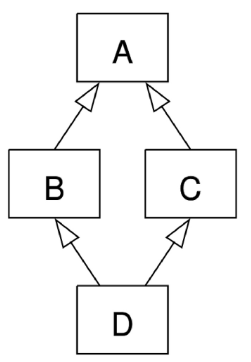

# 메서드 오버라이딩 (Method Overriding)
## 상속
한 클래스의 속성과 메서드를 다른 클래스가 물려받아 재사용하는 것.
### 상속의 개념
#### 상속이 필요한 이유
1. 코드 재사용성 증가
2. 계층 구조 형성
   - 부모-자식 관계를 통해 논리적 구조 형성
   - 상속을 통해 클래스간 계층 구조 형성 가능
3. 유지보수 용이
   - 공통 기능을 부모 클래스에 정의하여 코드 중복 최소화
   - 부모 클래스 수정 시 자식 클래스에 자동 반영
### 부모 클래스와 자식 클래스
```python
class Person: # 부모 클래스
    def __init__(self, name, age):
        self.name = name
        self.age = age
    def introduce(self):
        return f"Hello, my name is {self.name} and I am {self.age} years old."
class Student(Person): # 자식 클래스
    def __init__(self, name, age, gpa):
        self.name = name
        self.age = age
        self.gpa = gpa
class Teacher(Person): # 자식 클래스
    def __init__(self, name, age, subject):
        self.name = name
        self.age = age
        self.subject = subject
p1 = Professor("Dr. Smith", 45, "Mathematics")
s1 = Student("Alice", 20, 3.8)
# 부모 클래스의 메서드 호출
p1.introduce()  # "Hello, my name is Dr. Smith and I am 45 years old."
s1.introduce()  # "Hello, my name is Alice and I am 20 years old."
```
위와 같이 `Person` 클래스는 부모 클래스가 되고, `Student` 와 `Teacher` 클래스는 `Person` 클래스를 상속받는 자식 클래스가 된다.
따라서 `Student` 와 `Teacher` 클래스는 `Person` 클래스의 `introduce` 메서드를 그대로 사용할 수 있다.
### 메서드 오버라이딩
자식 클래스에서 부모 클래스의 메서드를 재정의하는 것.
```python
class Student(Person): # 자식 클래스
    def __init__(self, name, age, gpa):
        self.name = name
        self.age = age
        self.gpa = gpa
    def introduce(self):  # 메서드 오버라이딩
        return f"Hello, my name is {self.name}, I am {self.age} years old and my GPA is {self.gpa}."
s1 = Student("Alice", 20, 3.8)
s1.introduce()  # "Hello, my name is Alice, I am 20 years old and my GPA is 3.8."
```
위와 같이 `Student` 클래스에서 `introduce` 메서드를 재정의하면, `Student` 클래스의 인스턴스가 `introduce` 메서드를 호출할 때 부모 클래스인 `Person` 클래스의 `introduce` 메서드가 아닌, 자식 클래스인 `Student` 클래스의 `introduce` 메서드가 호출된다.

### 다중 상속
파이썬은 다중 상속을 지원하여, 하나의 자식 클래스가 여러 부모 클래스로부터 속성과 메서드를 상속받을 수 있다.

둘 이상의 상위 클래스로부터 여러 행동이나 특징을 상속받을 수 있다.

**중요** : 중복된 속성이나 메서드가 있는 경우 상속 순서(Method Resolution Order, MRO)에 따라 결정된다.
```python
class Person:
    def __init__(self, name):
        self.name = name
    def introduce(self):
        return f"Hello, my name is {self.name}."
class Mom:
    gene = "XX"
    def care(self):
        return "Caring for children."
    def swim(self):
        return "Mom swimming!"
class Dad:
    gene = "XY"
    def provide(self):
        return "Providing for family."
class Child(Mom, Dad):
    def swim(self):
        return "Swimming!"
    def cry(self):
        return "Crying!"
baby = Child()
print(baby.introduce())  # "Hello, my name is ."
print(baby.gene)       # "XX" (Mom 클래스의 gene 속성 상속)
# 먼저 상속된 Mom 클래스의 gene 속성이 호출됨
print(baby.swim())    # "Swimming!" (Child 클래스의 swim 메서드 호출)
```
#### 다이아몬드 문제
두 클래스 B, C가 클래스 A를 상속하고, 클래스 D가 B와 C를 상속받는 경우 발생하는 문제.



A에서 정의한 메서드를 B, C에서 각각 재정의 했을 때 D에서 해당 메서드를 호출하면 어떤 메서드가 실행될지 모호해지는 상황.

파이썬은 MRO(Method Resolution Order)를 사용하여 이 문제를 해결한다.
#### MRO (Method Resolution Order)
메서드 탐색 순서를 정의하는 규칙.
1. 자식 클래스에서 먼저 탐색
2. 그 다음 부모 클래스들을 왼쪽에서 오른쪽 순서로 탐색 (리스트에 나열된 순서)
3. 중복 방문 방지를 위해 C3 선형화 알고리즘 사용
```python
class A:
    def show(self):
        return "A"
class B(A):
    def show(self):
        return "B"
class C(A):
    def show(self):
        return "C"
class D(B, C):
    pass
d = D()
print(d.show())  # "B" (B 클래스의 show 메서드가 호출됨)
print(D.mro())  # [D, B, C, A, object] C3 선형화에 따른 메서드 탐색 순서
```
다음의 예시 코드와 같이 `className.mro()` 메서드를 사용하여 해당 클래스의 MRO를 확인할 수 있다.

### super() 메서드
MRO에 따라 부모 클래스의 메서드를 호출하는 방법.
```python
class Person:
    def __init__(self, name, age):
        self.name = name
        self.age = age
class Student(Person):
    def __init__(self, name, age, gpa):
        super().__init__(name, age)  # 부모 클래스의 __init__ 메서드 호출
        self.gpa = gpa
s1 = Student("Alice", 20, 3.8)
print(s1.name)  # "Alice"
print(s1.age)   # 20
print(s1.gpa)   # 3.8
```
`super()` 메서드를 사용하면 다중 상속 시에도 MRO에 따라 올바른 부모 클래스의 메서드를 호출할 수 있다.

단순히 "부모 클래스의 메서드 호출" 뿐만 아니라, 다중 상속 구조에서 올바른 메서드를 호출하는 데에도 유용하다.
#### 예시: 단일 상속에서 super() 사용
```python
class Person:
    def __init__(self, name, age):
        self.name = name
        self.age = age

#####################################
# super() 메서드 사용 전
# class Student(Person):
#     def __init__(self, name, age, gpa):
#         self.name = name
#         self.age = age
#         self.gpa = gpa
#####################################    

class Student(Person):
    def __init__(self, name, age, gpa):
        super().__init__(name, age)  # 부모 클래스의 __init__ 메서드 호출
        self.gpa = gpa
s1 = Student("Alice", 20, 3.8)
print(s1.name)  # "Alice"
```

#### 예시: 다중 상속에서 super() 사용
```python
class A:
    def greet(self):
        return "Hello from A"
class B(A):
    def greet(self):
        return "Hello from B"
class C(A):
    def greet(self):
        return "Hello from C"
class D(B, C):
    def greet(self):
        return super().greet()  # MRO에 따라 B의 greet 메서드 호출
d = D()
print(d.greet())  # "Hello from B"
print(D.mro())   # [D, B, C, A, object]
```


