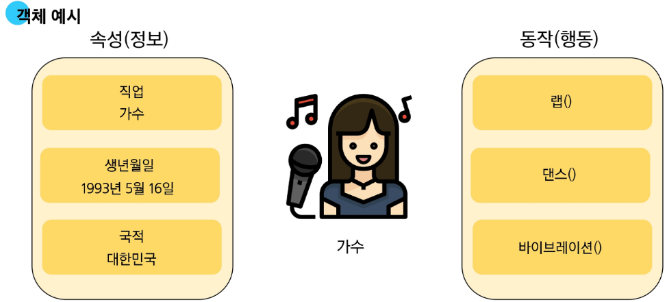

# 객체지향 프로그래밍 (OOP, Object Oriented Programming)
## 객체와 클래스
### 객체 (Object)
실제 존재하는 사물을 추상화 해 **'속성(변수)'** 과 **'동작(메서드)'** 을 가진다.

### 클래스 (Class)
객체를 만들기 위한 설계도.

데이터와 기능을 하나로 묶어 관리하는 방법.

사용자 정의 객체를 만드는 수단이자, 속성과 메서드를 정의하는 툴.
## 클래스
### 클래스
클래스를 만들 때 `__init__` 메서드를 사용하여 객체가 생성될 때 초기화 작업을 수행할 수 있다.
```python
class Person:
    def __init__(self, name, age):
        self.name = name
        self.age = age
```
### 인스턴스
클래스를 통해 생성된 객체
```python
person1 = Person("Alice", 30)
person2 = Person("Bob", 25)
```
### 클래스와 인스턴스
클래스를 만드는 것은 공통된 특성과 기능을 가진 **틀** 을 만드는 것.
ex) 붕어빵 틀

실제 객체들은 이 틀레서 생성된 **인스턴스** 들. 
ex) 붕어빵
### 클래스 구성요소
1. 생성자 메서드
   인스턴스 생성 시 자동 호출되는 메서드
2. 인스턴스 변수(속성)
   각 인스턴스별 고유한 속성.
    ```python
    self.name = name
    self.age = age
    ```
3. 클래스 변수(속성)
   모든 인스턴스가 공유하는 속성.
    ```python
    class MyClass:
        class_variable = "I am a class variable"
        self.instance_variable = "I am an instance variable"
    ```

### 클래스 변수와 인스턴스 변수
  클래스 변수와 동일한 이름으로 인스턴스 변수 생성 시, 인스턴스 변수를 우선적으로 참조하게 됨.
  
  local scope > instance scope > class scope
  ```python
  class Circle:
      pi = 3.14  # 클래스 변수

      def __init__(self, radius):
          self.radius = radius  # 인스턴스 변수

      def area(self):
          return Circle.pi * (self.radius ** 2)  # 클래스 변수 참조
  c1 = Circle(5)
  c2 = Circle(10)
  c1.pi = 100
  print(c1.pi)  # 100 (인스턴스 변수)
  print(c2.pi)  # 3.14 (클래스 변수)
  print(Circle.pi)  # 3.14 (클래스 변수)
  ```
## 메서드
클래스 내부에 정의된 함수.
### 인스턴스 메서드
인스턴스의 상태를 조작하거나, 동작을 수행한다.
```python
class Person:
    def __init__(self, name, age):
        self.name = name
        self.age = age

    def greet(self):
        return f"Hello, my name is {self.name} and I am {self.age} years old."
```
**반드시** 첫 번째 매개변수로 `self` 를 받아야 한다. (인스턴스 자신을 가리킴)

#### self 의 동작 원리
```python
'hello'.upper()
# 위 코드는 내부적으로 다음과 같이 동작함
str.upper('hello')
# 즉, 메서드 호출 시 첫 번째 인자로 해당 인스턴스가 자동으로 전달됨
```
다음과 같은 동작원리를 가지기 때문에 인스턴스 매서드의 첫번째 인자가 반드시 인스턴스 자기 자신을 가리키는 `self` 여야 한다.

### 생성자 메서드
`__init__` 메서드는 인스턴스가 생성될 때 자동으로 호출되어 초기화 작업을 수행한다.
```python
class Person:
    def __init__(self, name, age):
        self.name = name
        self.age = age
p1 = Person("Alice", 30)
```

### 클래스 메서드
클래스 변수를 조작하거나 클래스 레벨에서 동작하는 메서드.

`@classmethod` 데코레이터를 사용하며, 첫 번째 매개변수로 `cls` 를 받는다. (클래스 자신을 가리킴)
```python
class MyClass:
    class_variable = 0

    @classmethod
    def increment_class_variable(cls):
        cls.class_variable += 1
MyClass.increment_class_variable() 
print(MyClass.class_variable)  # 1
```
### 스태틱 메서드
클래스나 인스턴스 상태와 무관하게 동작하는 메서드.

`@staticmethod` 데코레이터를 사용하며, `self` 나 `cls` 를 받지 않는다.
```python
class MathUtils:
    @staticmethod
    def add(a, b):
        return a + b
result = MathUtils.add(5, 3)  # 8
```
클래스나 인스턴스에 관계 없이 독립적으로 동작함으로 헬퍼 함수라고 부르기도 함.

### 메서드 정리

| 메서드 종류 | 정의 | 특징 |
|-----------|------|-----|
| 인스턴스 메서드 | 인스턴스의 상태를 조작하거나 동작을 수행하는 메서드 | 첫 번째 매개변수로 `self` 를 받음 |
| 클래스 메서드 | 클래스 변수를 조작하거나 클래스 레벨에서 동작하는 메서드 | `@classmethod` 데코레이터 사용, 첫 번째 매개변수로 `cls` 를 받음 |
| 스태틱 메서드 | 클래스나 인스턴스 상태와 무관하게 동작하는 메서드 | `@staticmethod` 데코레이터 사용, `self` 나 `cls` 를 받지 않음 |

## etc
### 클래스와 인스턴스간 이름 공간
각 클래스와 인스턴스는 독립적인 이름 공간을 가진다.

인스턴스를 만들면, 인스턴스 객체가 생성되고, 독립적인 이름 공간 생성

### 매직 메서드 (Magic Method)
특수한 목적을 위해 미리 정의된 메서드들.
예) `__init__`, `__str__`, `__add__` 등
```python
class Point:
    def __init__(self, x, y):
        self.x = x
        self.y = y

    def __str__(self):
        return f"Point({self.x}, {self.y})"

    def __add__(self, other):
        return Point(self.x + other.x, self.y + other.y)